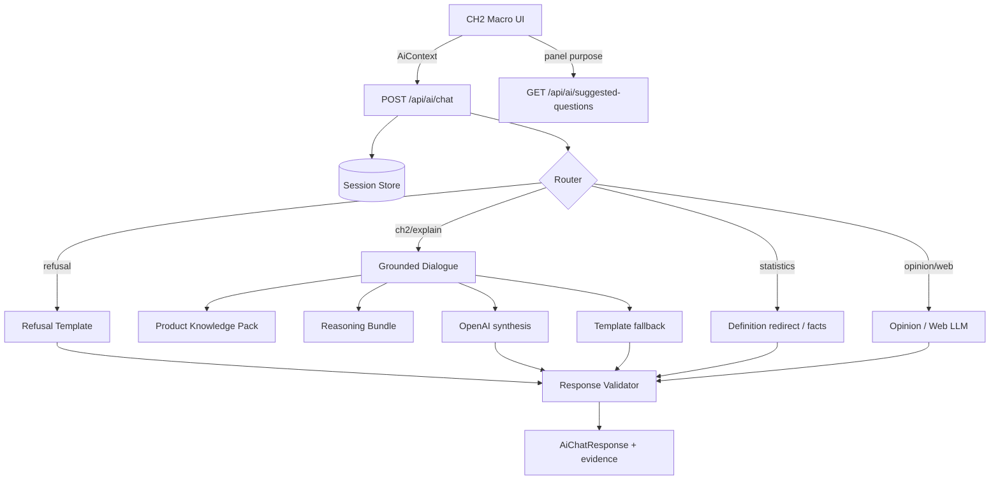

# CH2 AI 아키텍처

> 구현 가이드. 헌법: [CH2_AI_CONSTITUTION.md](./CH2_AI_CONSTITUTION.md)

---

## 1. 전체 구조


```mermaid
flowchart TB
  UI[CH2 Macro UI] -->|AiContext| Chat["POST /api/ai/chat"]
  UI -->|panel purpose| Suggest["GET /api/ai/suggested-questions"]
  Chat --> Session[(Session Store)]
  Chat --> Classify{Router}
  Classify -->|refusal| Ref[Refusal Template]
  Classify -->|ch2/explain| Synth[Grounded Dialogue]
  Classify -->|statistics| Stat[Definition redirect / facts]
  Classify -->|opinion/web| Other[Opinion / Web LLM]
  Synth --> PK[Product Knowledge Pack]
  Synth --> Bundle[Reasoning Bundle]
  Synth --> LLM[OpenAI synthesis]
  Synth --> Fallback[Template fallback]
  LLM --> Val[Response Validator]
  Stat --> Val
  Ref --> Val
  Other --> Val
  Fallback --> Val
  Val --> Out[AiChatResponse + evidence]
```

---

## 2. API 엔드포인트

| Method | Path | 설명 |
|--------|------|------|
| `POST` | `/api/ai/chat` | 세션 대화 (메인) |
| `POST` | `/api/ai/explain` | Explain layer만 자연어화 |
| `GET` | `/api/ai/suggested-questions` | panel·purpose별 추천 질문 |
| `GET` | `/api/ai/bundles/{bundle_id}` | Bundle 스키마·필드 설명 (디버그) |
| `GET` | `/api/ai/health` | LLM 키 설정 여부 |

---

## 3. AiChatRequest / Response

### Request

```json
{
  "session_id": "optional-uuid",
  "message": "왜 연식이 음수인가?",
  "context": {
    "app": "built",
    "panel": "RegressionCard",
    "purpose": "statistics",
    "scope": { "region_label": "충청북도 청주시 흥덕구 가경동", "asset_type": "detached" },
    "facts": { },
    "explain": null
  }
}
```

### Response

```json
{
  "session_id": "uuid",
  "route": "ch2",
  "answer": "…",
  "evidence": [
    { "type": "ch2_regression", "label": "CH2 회귀결과", "confidence": "high" }
  ],
  "bundle_id": "regression_diagnostic",
  "suggested_followups": ["신뢰구간이 넓은 이유는?"],
  "disclaimer": "…",
  "llm_used": false
}
```

---

## 4. Reasoning Bundle

Orchestrator: `(panel, facts) → bundle_id → AiDiagnosticPack`

### regression_diagnostic (복합)

`facts` = `RegressionRunResponse` JSON

추출 필드:

- `primary.n`, `primary.adj_r_squared`, `primary.coefficients`
- `vif`, `vif_warning`
- `correlations` (points는 요약만 LLM에)
- `warnings`

### trend_diagnostic · prediction_explain (Phase D)

- `trend_diagnostic` — land 매트릭스 연도별 rows · 장기추세 series
- `prediction_explain` — built predict API (y_hat · PI · CI)

### rent

- `rent_conversion` — 주거 전월세 전환율·환산 P50 (`RentListCard`)
- `sangkwon_reb` — 부동산원 상업용 임대동향 상권 공표 (`SangkwonCard`). 주거 원장과 섞지 않음.

### Phase 2 bundles (legacy 메모)

- `matrix_cell_explain` — land matrix cell

---

## 5. Router 규칙 (1차: 키워드)

1. **Refusal** — 적정가, 투자, 추천, 오를까, 전망, 싸다, 비싸다 …
2. **Statistics** — 순수 정의 → UI `?` 유도 · 해석형 → explain/ch2 우선
3. **Explain** — 왜 이 결과, 어떻게 해석/봐, 이번 표본 …
4. **Opinion** — 로그회귀, 방법론, trade-off, ~가 좋을까 (전망 키워드 없을 때)
5. **Web** — 금리, 국토부, 정책, 뉴스 … (Tavily · DuckDuckGo, 출처 URL evidence)
6. **CH2** — default (표본, Adj R², 계수, 신뢰구간 …)

---

## 6. Screen-bound

`context.panel` → `bundle_id` (registry)

AI는 **다른 panel의 API를 호출하지 않음**.  
비교 질문은 session `context_stack`의 snapshot diff만 허용.

---

## 7. 프론트 연동

**공통:** `shared/ai-assistant/AiAssistantPanel` — modal · trust badge · 섹션 렌더  
**Glossary:** `shared/stats-glossary` — 지표 `?` (토지·복합·집합·프로필·임대). 운영 헌법 [CH2_EXPLAIN_CONSTITUTION.md](./CH2_EXPLAIN_CONSTITUTION.md)

| 앱 | panel | 트리거 |
|----|-------|--------|
| built | `RegressionCard` | 회귀 성공 후 헤더 |
| built | `PredictionCard` | 예측 실행 후 PredictPanel 헤더 |
| land | `PaidMatrixCell` / `TrendCard` | 매트릭스 모달 헤더 (회귀·추세·장기추세 탭) |
| collective | `BuildingRegressionPanel` | 회귀 성공 후 |

`facts` = 해당 API 응답 JSON. AI는 **다른 panel API를 호출하지 않음**.

---

## 8. 환경 변수

```env
# optional — 없으면 템플릿 모드
OPENAI_API_KEY=
OPENAI_MODEL=gpt-4o-mini
AI_POLISH_ENABLED=false
AI_CASUAL_DIALOGUE_ENABLED=false
TAVILY_API_KEY=
AI_SESSION_TTL_SECONDS=86400
AI_RATE_LIMIT_PER_MINUTE=30
```

- **OPENAI_API_KEY** — Opinion·웹 요약·(선택) 템플릿 polish
- **AI_POLISH_ENABLED=true** — CH2 내러티브 문장 다듬기 (숫자 변경 시 자동 폐기)
- **AI_CASUAL_DIALOGUE_ENABLED=true** — *(실험)* 인사·짧은 잡담 허용. **사실·수치는 CH2 지식·Bundle만** ( `/api/ai/health` → `casual_dialogue_enabled` )
- **TAVILY_API_KEY** — 웹 검색 품질 향상 (없으면 DuckDuckGo Instant 폴백)

---

## 9. 구현 단계

| Phase | 내용 | 상태 |
|-------|------|------|
| A | 헌법·스키마·Router·Validator·템플릿 chat | ✅ |
| B | land/collective 연동 · comparison bundle · rate limit · shared UI | ✅ |
| C | 복합 UI AiAssistantPanel (modal) | ✅ |
| D | trend/matrix/prediction bundles · 내러티브 확장 | ✅ |
| F | Grounded Dialogue · Product Knowledge · UI glossary | ✅ |

---

## 11. Phase F — Grounded Dialogue

1. **Product Knowledge Pack** (`backend/app/ai/knowledge/`) — CH2 앱 구조·데이터·Twin/추천 요약
2. **Grounded synthesis** (`synthesis.py` + `llm.synthesize_grounded_answer`) — in-scope 질문 기본 경로
3. **Template fallback** — API 키 없음 · numeric drift 시 기존 내러티브 유지
4. **UI glossary** — `shared/stats-glossary` · 정의형 AI 질문 축소

### Polish layer (후순위)

- `AI_POLISH_ENABLED=true` + `OPENAI_API_KEY` 필요
- CH2 템플릿 내러티브(회귀·추세·예측) **위에** 문장만 다듬음
- 숫자 drift 시 polish **폐기** → 원본 템플릿 유지
- `ai_interpretation`: `gpt-4o-mini (polish)` 표시

---

## 12. 실험 — Casual Dialogue

`AI_CASUAL_DIALOGUE_ENABLED=true` 일 때:

| 유형 | 동작 |
|------|------|
| 인사·감사·작별 | `route=casual` — 짧은 응답, CH2 역할 안내 |
| 날씨·코딩 등 잡담 | `route=casual` — **답하지 않음**, 화면 통계 teaser + CH2 질문 유도 |
| CH2·통계 질문 | 기존 Grounded Dialogue (+ LLM 시 casual 톤 addon) |
| 적정가·투자·전망 | **여전히 refusal** |

기본값 `false` — 운영 영향 없음.

---

## 13. 실험 — Open Mode (LLM 능력 테스트)

`AI_OPEN_MODE=true` 일 때 **채팅만** 라우팅·템플릿·refusal·casual을 우회하고 LLM에 직접 연결합니다.

| 항목 | 동작 |
|------|------|
| Router / refusal / template | **우회** |
| Product Knowledge Pack | **미주입** (능력 vs 지식 분리) |
| 화면 facts | `service`·`page`·`scope`·`analysis_type` + 숫자 soft cite. invent 금지 |
| Insight 카드 | **변경 없음** (A/B 비교용) |
| `route` | `"open"` |

개발·검증 전용. 기본값 `false`. health: `open_mode_enabled`.

**운영 실험 (2026-08-17):** 로컬과 같이 VPS `AI_OPEN_MODE=true`.  
주제 울타리는 키워드 목록이 아니라 **현재 화면 컨텍스트**.  
사용량: 서버 전체 월 200회 + 1만 원, 80% 경고 / 100% 중지. 장부는 관리자 `?tool=ai`. 질문 문장은 저장하지 않는다.

---

## 14. 참고

- [BUILT_HANDOFF_AND_ROADMAP.md](./BUILT_HANDOFF_AND_ROADMAP.md) §4 AI (구 초안)
- `backend/app/collective/analysis_explain.py`
