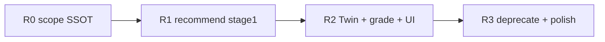

# CH2 Recommendation Engine — 모형 추천 UX·단계 설계 (장기)

> **상태:** R0~R3 **복합 built 구현 완료** (2026-08-07) — 집합·토지 adapter는 R4+  
> **범위:** 복합·토지·집합 공통 **모형 추천** 제품·엔진 방향 (1차 착수: **복합 built**)  
> **상위:** [CH2_MACRO_VISION.md](./CH2_MACRO_VISION.md) · [CANDIDATE_EVALUATION_DESIGN.md](./CANDIDATE_EVALUATION_DESIGN.md) · [CH2_MACRO_IMPLEMENTATION_ROADMAP.md](./CH2_MACRO_IMPLEMENTATION_ROADMAP.md)  
> **관련:** [LAND_BUILT_SIGNAL_DESIGN.md](./LAND_BUILT_SIGNAL_DESIGN.md) · [SYSTEM_ARCHITECTURE.md](./SYSTEM_ARCHITECTURE.md)

---

## 1. 목적

CH2 Macro 모형 추천의 경쟁력은 **「더 똑똑한 한 줄의 식」** 이 아니라  
**「왜 그렇게 추천했는지를 단계별로 설명하는 과정」** 에 있다.

본 문서는 다음을 정의한다.

1. **기본 통계** vs **모형 추천** 역할 분리  
2. **`analysis_scope` SSOT** — 지역·기간·필터 공유  
3. **단계형 추천** — 1단계 Local 최적화 → (조건부) 2단계 Twin pool  
4. **동일 후보·이중 랭킹** — 설명형(AIC/BIC) vs 예측형(MAPE/CV-MAPE)  
5. **만족 등급** — 고정 CV 임계값 대신 도메인별 ★·Excellent~Poor  
6. **추천 종료 이유** — AI·UI 내러티브 SSOT  
7. **CH2 Recommendation Engine** — Built 전용이 아닌 토지·집합 확장 골격

**현행 구현과의 관계:** 복합 `Group Forward` · `Best Subset` · `evaluate_pooling_candidates` 는 **엔진 재료**로 유지하되, **UX·scope·단계·설명**은 본 설계로 **재배치**한다.  
**2026-08 UI 마이그레이션:** [BUILT_REGRESSION_ANALYSIS_UI.md](./BUILT_REGRESSION_ANALYSIS_UI.md) — 모달 제거·세로 카드 흐름 (P0 구현 중). 왼쪽 변수·회귀모형 선택은 **유지**; Macro 예측형·설명형은 **독립 실행**.

---

## 2. 두 화면의 역할 (불변)

| | **기본 통계** | **모형 추천** |
|---|----------------|----------------|
| **주체** | 사용자 | AI **안내** (채택은 항상 사용자) |
| **식** | 사용자가 만든 식 | AI가 **탐색**한 식 **제안** |
| **변수** | 사용자가 체크한 블록 **전부** 사용 | **사용자 체크와 무관** — 제품 SSOT 탐색 풀에서 선택 |
| **회귀 방식** | 선형 / log / log-log (사용자) | 1단계에서 **linear vs log** 자동 (log-log는 도메인별 2순위, [미완] 복합은 Phase 2) |
| **지역 scope** | 사용자 (본·인접·교차 단위) | **`analysis_scope` 동일** |
| **인접** | 사용자가 칩/지도로 **직접 선택** (이하 **「선택 인접」**) | scope에 포함된 데이터로 1단계 수행 |
| **Twin** | 기본 통계에는 **없음** | 2단계 **Profile Twin** (이하 **「쌍둥이 지역」**) — anchor = **본 지역** |

**핵심 UX 문장:**  
> 「체크한 변수와 추천 변수가 다른 이유」는 **버그가 아니라 역할 분리**다.

---

## 3. `analysis_scope` SSOT

모든 화면·API가 **동일 scope 객체**를 참조한다.

```text
analysis_scope
├── domain          # built | land | collective
├── asset_slice     # commercial | factory | detached | unified | matrix_cell …
├── region_units    # 본·인접·교차 분석 단위 (canonical + ledger expand)
├── anchor_unit     # Twin·내러티브 기준 **본 지역** (복수 선택 시 focus 1개)
├── time            # as_of_month, window_years, year_from/to
├── sample_filters  # IQR, zone, road, … (도메인별)
└── scope_label     # UI 표시용 「봉명동 + 운천동」
```

**규칙**

- 기본 통계 `POST /regression/run` 과 모형 추천 `POST /regression/suggest` 는 **같은 `analysis_scope`** 를 입력으로 받는다.  
- **변수 블록(`variables`)은 scope에 포함하지 않는다** — 추천 API는 SSOT 탐색 풀을 서버에서 결정.  
- 사용자가 **선택 인접**까지 포함하면 1단계 pool = **그 union 거래**; **쌍둥이 지역** 후보는 **anchor_unit** Profile Twin만 (선택 인접 ≠ Twin).

**장기:** 토지·집합도 동일 `analysis_scope` shape + domain adapter.

---

## 4. 단계형 추천

### 4.1 흐름 (기본)

```text
[모형 추천 열기]
    │
    ▼
┌─ 1단계 ─ Local (analysis_scope 거래만)
│     · SSOT 변수 블록 전체에서 조합 + linear/log 탐색
│     · 설명형·예측형 랭킹 산출
│     · 만족 등급 + 종료 이유 평가
│     │
│     ├─ 종료 (1단계로 충분) ──► 최종 내러티브 + 사용자 채택
│     │
│     └─ 2단계 필요 ──► (아래)
│
└─ 2단계 ─ Twin pool (1단계 **최적 식 고정**, 표본만 확대)
      · anchor = analysis_scope.anchor_unit
      · Profile Twin gate 통과 지역만
      · pool 조합은 **Forward Pooling**(V3-7) 또는 상위 k — [미완] 초기는 top1/top3/전체
      · CV-MAPE 등 **재평가** 후 종료 이유 + 최종 제안
```

**1단계에서 고정하는 것:** `recommended_blocks`, `response_scale` (linear | log).  
**2단계에서 바꾸는 것:** `fit_sample` 지역 pool **만** (변수·스케일 **불변**).

### 4.2 2단계 **자동 진입** (예외)

기본 순서는 Local → Twin 이지만, **표본이 극소**면 1단계 Local 탐색을 **생략·축약**하고 2단계 안내를 **즉시** 할 수 있다.

| 조건 (예) | AI 안내 (예) |
|-----------|----------------|
| `n_tx < MIN_LOCAL_N` (도메인별, [미완] 복합 초기값 15) | 「표본이 너무 적습니다. 쌍둥이 지역 pool부터 검토합니다.」 |
| complete-case 후 `n < 10` | 「회귀 최소 조건 미달 — Twin pool 또는 scope 확대를 권합니다.」 |

**자동 진입 ≠ Twin 강제 채택.** 여전히 **사용자 채택**.

### 4.3 2단계 진입 — **고정 CV % 금지**

**CV-MAPE &lt; 50% = 충분** 같은 **제품 고정 임계값은 두지 않는다.**  
자산·도메인마다 MAPE 스케일이 다르다 (공장 25% vs 아파트 25%).

대신 **만족 등급(Satisfaction Grade)** SSOT:

| 등급 | UI (예) | 의미 |
|------|---------|------|
| **Excellent** | ★★★★★ | 1단계 종료 후보 |
| **Good** | ★★★★☆ | 1단계 종료 가능; 2단계는 **선택** |
| **Fair** | ★★★☆☆ | 2단계 Twin **권장** |
| **Poor** | ★★☆☆☆ 이하 | 2단계 **강력 권장** + scope·변수 한계 명시 |

**내부 매핑 (조정 가능, [미완] 복합 v1 초안):**

- `cv_mape` + `n_tx` + `asset_slice` → 등급 lookup 테이블 (YAML/DB, **운영 보정**)
- UI·AI는 **등급과 이유**만 노출; raw %는 **보조**

집합·토지는 **별도 lookup** (동일 프레임, 다른 숫자).

---

## 5. 동일 후보 · 이중 랭킹 (설명형 / 예측형)

**별도 탐색 두 번 하지 않는다.**  
한 번 생성한 **후보 집합**을 **두 기준**으로 정렬만 다르게 보여 준다.

```text
candidate_universe  (예: 블록 subset × linear/log, 최대 128)
        │
        ├── explanatory_rank  → AIC 1위, BIC 1위, … (설명형 탭)
        └── predictive_rank   → CV-MAPE 1위, MAPE 1위, … (예측형 탭)
```

**UI 카피 (예):**  
> 「같은 후보 120개 중, **설명**에서는 AIC 1위, **예측**에서는 CV-MAPE 1위가 다릅니다.」

**1단계 최종 제안 ( [미완] v1 기본):**

- **Primary:** 예측형 1위 (CH2 Vision — 예측형 순위 1차)  
- **Alternate:** 설명형 1위 — 탭에서 **한 클릭** 비교  
- AI 내러티브에 **둘 다** 언급

---

## 6. SSOT 변수 탐색 풀 (모형 추천 전용)

기본 통계 체크박스와 **분리**된 서버-side 풀.

### 6.1 복합 (built) — [미완] v1

| 블록 | 포함 | 비고 |
|------|------|------|
| gross_area | ✅ | |
| land_area | ✅ | |
| building_age | ✅ | |
| road_width | ✅ | 더미 묶음 |
| zone_type | ✅ | 통합 시 단독 `(null)` 처리 **엔진** |
| building_use | ✅ | |
| asset_type | unified만 | |
| region_leaf | scope leaf ≥2일 때만 | |

**complete-case:** 후보 union 기준 **한 번** 고정 → `selection_n` 표기.  
**최종 적합 n:** 선택된 블록 subset 기준 **별도** 표기 (봉명동 47 vs 77 혼란 방지).

### 6.2 토지 · 집합 — [장기]

동일 **블록·단계·등급·종료 이유** 프레임; 블록 ID·종속변수·Validation만 domain adapter.

---

## 7. 추천 **종료 이유** (Termination Reasons)

모형 추천 API는 **최종 식**과 함께 **`termination`** 객체를 반환한다.

```json
{
  "stage_reached": 1,
  "action": "stop",
  "grade": "good",
  "reasons": [
    "현재 분석 범위(봉명동+운천동)만으로 CV-MAPE 등급 Good",
    "표본 n=77 — Twin 추가 시 개선 폭이 작음 (Δ CV 3.2%p)",
    "Twin gate: 후보 2곳 중 1곳만 가격수준 통과"
  ],
  "next_stage_hint": null
}
```

**2단계 진행 시 `action`: `"proceed_twin"`** 예:

```json
{
  "stage_reached": 2,
  "action": "stop",
  "grade": "fair",
  "reasons": [
    "1단계 Local CV-MAPE 등급 Fair — 표본·예측력 보강 필요",
    "탄방동 pool 추가 시 CV-MAPE 34% → 24% (등급 Good)",
    "1단계와 동일 변수·log 스케일 유지"
  ],
  "recommended_pool": "twin_top1"
}
```

**AI Bundle / UI:** `reasons[]` 를 **번호 목록 내러티브**로 변환 (§9).

---

## 8. AI 안내 원칙

- **Facts-only** — n, 등급, AIC/CV, gate 실패 사유, pool 지역명  
- **단계별 서사** — 「① 범위 → ② 예측력 → ③ Twin 검토 → 최종」  
- **채택 금지** — 「이 모형이 정답」 ✗ / 「아래 식을 **검토**하세요」 ○  
- **용어 분리** — 「선택 인접」(사용자 scope) vs 「쌍둥이 지역」(Profile Twin)

Profile·Twin은 **후보 제안**; Validation(거래자료·CV)이 **판단**. ([CH2_MACRO_VISION.md](./CH2_MACRO_VISION.md))

---

## 9. 사용자-facing 내러티브 템플릿 (예)

> **① 분석 범위** (봉명동 + 운천동)에서 설명력·예측력 관점 후보를 탐색했습니다.  
> → **log** 모형 · 변수: **대지면적 + 연식 + 도로조건** (설명형 AIC 1위와 일치)  
>
> **② 예측력**을 검토했습니다.  
> → CV-MAPE **34%** · 만족 등급 **보통(Fair)**  
>
> **③ 쌍둥이 지역** pool을 검토했습니다.  
> → **탄방동** 추가 시 CV-MAPE **24%** (등급 **양호(Good)**)  
>
> **추천 종료 이유:** 1단계만으로는 Fair → Twin 1곳 pool 시 Good 달성, gate 통과.  
>
> **최종 제안 (채택은 사용자):**  
> 봉명동+운천동+**탄방동** pool · log · 대지+연식+도로

---

## 10. UI 구조 (복합 v1 — **2026-08-09 갱신**)

> **SSOT:** [BUILT_REGRESSION_ANALYSIS_UI.md](./BUILT_REGRESSION_ANALYSIS_UI.md)

```text
[왼쪽 사이드바 — 유지]
  변수 선택 · 회귀모형(linear/log) · scope · 「통계분석」

[오른쪽 세로 흐름]
  ① 회귀 실험 — 사용자 변수·스케일 결과 (FocusRegressionCard)
  ② Macro 예측형 — CV-MAPE · 독립 「탐색 실행」 · (opt-in) Twin
  ③ Macro 설명형 — AIC · 독립 「탐색 실행」 · 계수 해석
  ④ 상위 지역 — comparisons[] 참고 (인라인 카드)
```

**핵심 규칙**

- ②·③ **순서 강제 없음** — recommend API 1회 응답을 두 카드가 각각 primary/alternate 슬라이스로 표시
- Twin은 ②에서만 CTA; **자동 pool 적용 금지**
- `RecommendationModal` → **deprecated**; `BuiltRegressionAnalysisPanel` 인라인

**현행 대비 제거·축소**

- 모달 진입 → 본문 세로 카드  
- Twin top1/3/전체 **동시** 나열 → 2단계 **순차** + 개선폭만  
- 모달 추천 n vs 예측 n **혼선** → `selection_n` / `fit_n` / `scope_n_tx` **3종 라벨**

---

## 11. API·엔진 ( [미완] 목표 shape)

### 11.1 엔드포인트 (복합)

| Method | Path | 역할 |
|--------|------|------|
| POST | `/built/regression/recommend` | **신규** — 단계형 추천 + termination + dual rank |
| POST | `/built/regression/run` | 기본 통계 (변경 없음, scope SSOT 정렬) |

**[현행]** `/regression/suggest`, `/compare` → recommend **흡수·deprecated** (마이그레이션 기간 병행).

### 11.2 응답 (개략)

```typescript
interface RecommendationResponse {
  analysis_scope: AnalysisScope;
  stage1: {
    candidates_explanatory: ModelCandidate[];  // top-k by AIC
    candidates_predictive: ModelCandidate[]; // top-k by CV-MAPE
    primary: ModelCandidate;
    selection_n: number;
    fit_n: number;
    satisfaction: { grade: string; stars: number; cv_mape?: number };
  };
  stage2?: {
    pools: PoolCandidate[];
    primary?: PoolCandidate;
    improvement?: { cv_mape_delta: number };
  };
  termination: TerminationInfo;
  narrative_hints: string[];  // AI Facts
  explain?: AnalysisExplain;
}
```

### 11.3 CH2 Recommendation Engine (패키지 [미완])

```text
backend/app/recommendation/
├── scope.py           # analysis_scope SSOT
├── stages.py          # stage1_local, stage2_twin
├── ranks.py           # explanatory vs predictive
├── satisfaction.py    # grade lookup per domain
├── termination.py     # 종료 이유 생성
└── adapters/
    ├── built.py
    ├── land.py        # [장기]
    └── collective.py  # [장기]
```

복합 `selection/` 코드는 **adapter가 호출**하는 lower layer로 유지.

---

## 12. Validation Contract 정합

[CANDIDATE_EVALUATION_DESIGN.md](./CANDIDATE_EVALUATION_DESIGN.md) 와 **충돌 없음**:

| 원칙 | 본 설계 |
|------|---------|
| 동일 complete-case 비교 | 후보 universe 1회 고정 |
| 예측형 1차 = CV-MAPE | 예측형 탭·1단계 primary |
| Profile은 가설 | Twin = 2단계, gate 유지 |
| Decision Confidence | termination + grade + rank gap **통합** ([미완] 필드 재설계) |

---

## 13. 구현 로드맵

| Phase | 내용 | 도메인 |
|-------|------|--------|
| **R0** | `analysis_scope` 타입·API 정렬; UI scope 라벨 | built |
| **R1** | recommend API: 1단계 only; SSOT 풀; dual rank; termination v0 | built |
| **R2** | 2단계 Twin 순차; auto-skip; grade table v1; 내러티브 UI | built |
| **R3** | 기본 통계와 변수 분리 UX; n 라벨 3종; suggest/compare deprecate | built |
| **R4** | land adapter | land |
| **R5** | collective 주거·비주거 adapter (패리티) | collective |

**Land Signal** ([LAND_BUILT_SIGNAL_DESIGN.md](./LAND_BUILT_SIGNAL_DESIGN.md)) 은 **별 트랙** — Recommendation Engine **후보 Feature(C9)** 로 Phase R6+ 편입 가능.

---

## 14. Decision Log 후보 (착수 시)

- D-xxx **기본 통계 / 모형 추천 변수 역할 분리**  
- D-xxx **`analysis_scope` SSOT**  
- D-xxx **단계형 Twin (식 고정·pool만)**  
- D-xxx **만족 등급 — 고정 CV % UI 금지**

---

## 15. 현행 구현 gap 요약

| 항목 | 현행 (2026-08) | 목표 |
|------|----------------|------|
| 변수 | 왼쪽 체크 = 후보 풀 | SSOT 서버 풀 |
| Twin | 1단계와 동시 | 2단계 순차 (+ 극소 n auto) |
| 설명/예측 | 혼재 | 동일 후보·탭 분리 |
| scope | 암묵적 regBody | `analysis_scope` |
| 종료 이유 | 없음 | `termination` + AI |
| n 표기 | 혼선 | n_tx / selection_n / fit_n |

---

## 16. 구현 계획 (2026-08-07) — 복합 built 우선

> **상태:** R0~R3 **복합 built 구현 완료** (2026-08-07). §16 실행 계획 — **R0~R3 완료**, R4+ 집합·토지 adapter.

### 16.1 지난 논의 핵심 (리뷰)

| 합의 | 요약 |
|------|------|
| 역할 분리 | 기본 통계 = 사용자 변수·스케일 / 모형 추천 = SSOT 풀 탐색 + AI 안내 |
| scope SSOT | `analysisUnits` → region_codes/addrs; **변수는 추천 scope 밖** |
| 단계형 | 1 Local 최적 (변수+log) → 2 Twin pool (**식 고정**) |
| 이중 랭킹 | **동일** 후보 universe · 설명(AIC/BIC) / 예측(CV-MAPE) 탭 |
| 등급 | CV 50% 고정 ✗ · Excellent~Poor + ★ (도메인 lookup) |
| Twin 예외 | n 극소 시 2단계 **자동 진입** (채택 강제 ✗) |
| 종료 이유 | `termination.reasons` + 단계별 내러티브 |
| n 라벨 | `scope_n_tx` / `selection_n` / `fit_n` 분리 (봉명동 혼선 해소) |

**재사용 (신규 작성 최소화):** `selection/forward.py`, `best_subset.py`, `fit.py`, `pooling.py`, `candidates/*`, `context.with_complete_case`.

**미포함 (v1):** log-log 추천, `/suggest`·`/compare` 즉시 삭제, land/collective adapter.

---

### 16.2 Phase R0 — `analysis_scope` 정렬 (1~2일)

**목표:** 기본 통계·모형 추천이 **같은 지역·기간**을 공유; anchor 식별.

| # | 작업 | 산출 |
|---|------|------|
| R0-1 | `AnalysisScope` Pydantic + TS type | `backend/app/recommendation/scope.py`, `frontend-built/src/types.ts` |
| R0-2 | `RegressionRunRequest` → `AnalysisScope` 추출 헬per | `scope_from_built_request(req, anchor_unit?)` |
| R0-3 | anchor 규칙: `analysisUnits[0]` (non-crossParent) 또는 `profileTarget` | `builtAnalysisUnits.ts` + backend mirror |
| R0-4 | `scope_label` 조합 (다단위 「봉명+운천」) | 기존 `formatScopeLabel` 재사용 |
| R0-5 | `scope_n_tx` — 필터만 통과한 원장 건수 API 필드 | selection context 또는 recommend prelude |

**파일:** `scope.py`, `schemas.py` (optional embed), `App.tsx` (scope payload 빌드), `ModelExploreModal.tsx`.

**검증:** 동일 `analysisUnits`로 `/run` vs (준비) `/recommend` scope_label·codes 일치 contract test.

---

### 16.3 Phase R1 — `/recommend` 1단계 (3~5일)

**목표:** SSOT 탐색 풀 + dual rank + termination v0; **Twin 없음**.

| # | 작업 | 산출 |
|---|------|------|
| R1-1 | `DEFAULT_BUILT_CANDIDATE_BLOCKS` — §6.1 SSOT | `recommendation/adapters/built.py` |
| R1-2 | `resolve_recommendation_pool(blocks, scope, unified, region_leaf≥2)` | region_leaf 조건부 |
| R1-3 | `run_stage1_local()` — Best Subset universe (≤128) **한 번** | `recommendation/stages.py` |
| R1-4 | `rank_explanatory` (AIC/BIC top-k) + `rank_predictive` (CV-MAPE/MAPE top-k) | `recommendation/ranks.py` |
| R1-5 | `primary` = predictive #1; `alternate` = explanatory #1 | 응답 스키마 |
| R1-6 | `RegressionRecommendResponse` schema | `built/schemas.py` |
| R1-7 | `POST /built/regression/recommend` | `built/router.py` |
| R1-8 | `termination` v0 — grade 없이 reasons만 (n, cv_mape, rank gap) | `recommendation/termination.py` |
| R1-9 | `satisfaction` stub — grade= `"pending"` 또는 Fair/Good 하드코드 **없음** | R2에서 lookup |

**complete-case:** SSOT 풀 union → `selection_n`; 최종 primary 블록 → `fit_n` **별도 계산·반환**.

**테스트:**
- `test_built_recommend_stage1.py` — mock df / fixture scope
- SSOT 풀이 `req.variables` 무관함 assert
- 동일 universe에서 AIC 1위 ≠ CV 1위 케이스

**프론트 (병행):**
- `recommendRegression()` client
- 모달 **1단계-only** 프로토타입 (기존 suggest 병행 가능)

---

### 16.4 Phase R2 — 2단계 Twin + 등급 + UI (4~6일)

**목표:** 순차 Twin; auto-skip; 만족 등급; 종료 이유·내러티브 UI.

| # | 작업 | 산출 |
|---|------|------|
| R2-1 | `run_stage2_twin(stage1_primary, anchor, twin_neighbors)` | `pooling.py` refactor — **식 고정** pool only |
| R2-2 | stage1 grade → `proceed_twin` / `stop` (lookup v1 YAML) | `recommendation/satisfaction/built.yaml` |
| R2-3 | `MIN_LOCAL_N=15`, n&lt;10 → auto stage2 또는 abort + reasons | §4.2 |
| R2-4 | Twin pool **순차 UI** — Local 결과 → 「Twin 검토」→ pool 카드 1~3개 | `RecommendationModal.tsx` (신규 또는 ModelExploreModal 대체) |
| R2-5 | 탭 **[설명형] [예측형]** — 동일 후보 ID, 정렬만 변경 | ComparePanel 리팩터 |
| R2-6 | `termination` full + `narrative_hints[]` | AI Bundle 연동 |
| R2-7 | 채택 버튼 분리: 「1단계 적용」「2단계 pool 적용」 | `App.adoptModel` 확장 (pool region_codes optional) |

**Twin pool v1:** 기존 top1/top3/전체 — **순차 표시** (동시 4카드 ✗). Forward Pooling(V3-7)은 R2+.

**테스트:**
- stage1 Good → stage2 skip path
- n=9 → auto stage2 message
- twin gate fail → reasons in termination

---

### 16.5 Phase R3 — UX 마무리·deprecate (2~3일) ✅

| # | 작업 | 상태 |
|---|------|------|
| R3-1 | 모달·카드 **n 라벨** 3종 (`scope_n_tx`, `selection_n`, `fit_n`) | ✅ `recommendationLabels.tsx` |
| R3-2 | 기본 통계 사이드바에 「모형 추천은 변수와 무관」1줄 안내 | ✅ `App.tsx` |
| R3-3 | `/suggest`, `/compare` deprecated header + JSON `deprecated`/`successor_path` | ✅ (thin wrapper 미적용 — legacy 엔드포인트 유지) |
| R3-4 | `ModelExploreModal` → `RecommendationModal` / suggest·compare 탭 제거 | ✅ re-export 호환 |
| R3-5 | 예측 미리보기: **채택 예정 식** 기준 `fit_n` 표기 | ✅ `PredictPanel` |
| R3-6 | `docs/DECISIONS.md` D-032~035 등록 | ✅ |

**회귀 테스트:** `test_built_model_selection_blocks.py` 유지 + recommend integration smoke.

---

### 16.6 파일·모듈 map (목표 구조)

```text
backend/app/recommendation/
├── __init__.py
├── scope.py              # R0
├── ranks.py              # R1
├── termination.py        # R1→R2
├── satisfaction.py       # R2 + built.yaml
├── stages.py             # R1 stage1, R2 stage2 orchestration
└── adapters/
    └── built.py          # SSOT blocks, pool resolver

backend/app/built/regression/selection/   # lower layer (유지)
backend/app/built/router.py               # + /recommend

frontend-built/src/
├── api/client.ts                           # recommendRegression
├── types.ts                                # RecommendationResponse
├── components/RecommendationModal.tsx    # R2 (ModelExploreModal 대체)
├── components/RecommendationStagePanel.tsx
├── components/RecommendationRankTabs.tsx
└── utils/recommendationNarrative.ts      # §9 템플릿
```

---

### 16.7 의존성·순서



**병렬 가능:** R1 backend 완료 후 frontend R1 프로토타입; R2 UI는 R1 API contract freeze 후.

---

### 16.8 리스크·완화

| 리스크 | 완화 |
|--------|------|
| anchor 복수 단위 모호 | `analysisUnits[0]` SSOT + UI에 anchor 명시 |
| unified zone_type complete-case | SSOT 풀 탐색 시 엔진 detached `(null)` 규칙 유지; `fit_n` 별도 표기 |
| CV fold 부족 → grade 불가 | grade=`"insufficient_cv"` + 2단계 권장 only |
| Twin 채택 시 `/run` scope 확장 | adopt 시 `region_codes` pool merge — **별 PR** 명시 |
| 기존 사용자 suggest 워크플로 | R3까지 `/suggest` wrapper 유지 |

---

### 16.9 Phase별 완료 기준 (Acceptance)

**R0:** 같은 `analysisUnits`로 run/recommend 요청 시 `scope_label`·`region_codes` 동일.

**R1:** `variables` 전부 false여도 recommend 동작; dual rank top-1 반환; `selection_n` ≥ `fit_n` 관계 문서화.

**R2:** Fair 등급 → UI에 「Twin 검토」단계 표시; auto-skip n&lt;15 케이스 E2E; termination ≥2 reasons.

**R3:** 봉명동 시나리오 재현 — 모달 n 라벨 혼선 없음; 「이 모형으로 분석」이 primary(예측형 1위) 반영.

---

### 16.10 추정 일정 (참고)

| Phase | effort | 누적 |
|-------|--------|------|
| R0 | 1~2d | 2d |
| R1 | 3~5d | 7d |
| R2 | 4~6d | 13d |
| R3 | 2~3d | **~16d** (1인 풀타임 기준) |

**첫 PR 권장:** R0 + R1 backend + contract test (UI 없이 curl/ pytest).  
**두 번째 PR:** R1 frontend proto + R2 stage2 backend.  
**세 번째 PR:** R2 UI + R3.

---

*§16 추가: 2026-08-07 — 구현 착수용 실행 계획.*

