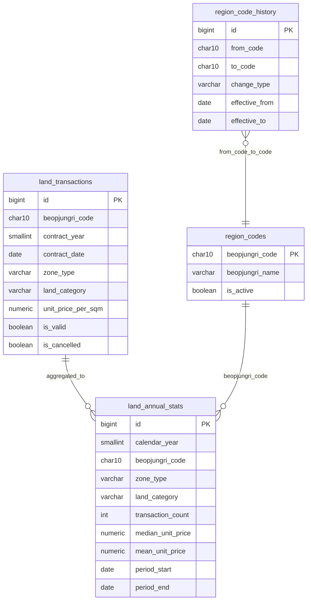

# CH2 Macro — 장기 시계열(연도별) 추세 설계

> 상태: **설계 확정 초안** (v1 범위) — 구현 전 리뷰.  
> 관련: [V2_STATS_DESIGN.md](./V2_STATS_DESIGN.md) · [DECISIONS.md](./DECISIONS.md) D-013 · DDL `db/014_land_annual_stats.sql`

---

## 1. 목표·범위

### 1.1 목표

- **2010~현재**(약 17년) 토지 실거래 **연도별** 추세를 제공한다.
- **유료 필터분석** 흐름 위에 **장기 추세 모달**을 추가한다 (기본통계 롤링 창과 분리).
- 연도×법정동/리×용도×지목 데이터는 **사전 집계 DB**에 두고, 모달은 **조회만** 한다.

### 1.2 v1 제품 범위 (확정)

| 항목 | v1 |
|------|-----|
| 진입 | 필터분석 매트릭스 **용도×지목 셀 클릭** → 모달 **「장기 추세」** 탭 |
| 지역 | **복수 선택 허용** (유료 상한 **최대 10** — D-010) |
| 지역 표시 | **합산 1선 금지** — **지역별 시리즈**를 **한 차트·한 모달**에 겹침 |
| 고급 필터 | **미적용** (도로·면적·지분·IQR 이상치·면적㎡ 범위) |
| 시간 축 | **만년력 `calendar_year`** (1/1~12/31, `contract_date` 기준) |
| 기본통계 | **변경 없음** (`as_of_month` + 롤링 3·5년) |
| 필터분석 본문 | **변경 없음** (선택 연도·전 필터·합산 매트릭스) |

### 1.3 사용자 흐름

```
① 복수 지역 선택 (예: 가경동, 비하동)
② (선택) 기본통계 보기  또는  필터분석 실행
③ 매트릭스 셀 클릭 → 장기 추세 모달
   · 가경동 ——  (중앙값/거래량 연도별)
   · 비하동 ——  (동일 용도×지목, 같은 차트)
```

---

## 2. 행정구역 이력 관리

### 2.1 조사 항목 (backfill 전)

| 항목 | 내용 |
|------|------|
| 2010~현재 행정구역 변경 | 시·군·구·동·리 신설·폐지 |
| 법정동 코드 변경 | 10자리 코드 재부여 |
| 통폐합 | A+B→C, 분리 |
| 명칭 변경 | 코드 유지·코드 변경 모두 |

**권장 출처 (확정 필요):** 행정안전부 법정동 코드 변경 이력, 과거 `region_codes` 스냅샷, 통·폐합 고시.

### 2.2 설계 원칙

| 계층 | 규칙 |
|------|------|
| **원장** `land_transactions` | ingest 시점 **`beopjungri_code` 보존** (덮어쓰지 않음) |
| **연도 마트** `land_annual_stats` | **`region_codes` 현행 코드** 기준으로 집계 (remap 후) |
| **이력** `region_code_history` | `from_code → to_code`, `effective_from`/`effective_to`, `change_type` |

선택 컬럼(원장 확장, v2 이후):

- `original_beopjungri_code` — 정제 시점 원코드 (이미 매핑된 경우만)
- 마트에는 **현행 코드만** 저장 → API는 `region_codes.beopjungri_name` JOIN

### 2.3 집계 시 remap

1. `contract_date`로 **calendar_year** 결정  
2. 해당 연도 말(또는 정책상 **집계 기준일**)에 유효한 `region_code_history`로 **현행 코드** 산출  
3. `GROUP BY calendar_year, beopjungri_code, zone_type, land_category`

v1: remap 테이블이 비어 있으면 **원장 코드 = 마트 코드** (2021~ 구간은 현행 clean 파이프라인과 동일).  
2010~2020 backfill 시 이력 테이블 **필수**.

---

## 3. 현재 분석 vs 장기 추세 (역할 분리)

| | 기본통계 (V2) | 필터분석 | 장기 추세 (v1) |
|--|---------------|----------|----------------|
| 시간 | `as_of_month` 롤링 N년 | 선택 **연도 칩** (만년력) | **2010~… 전 연도** |
| 지역 | 복수 가능 (bulk) | 복수 (≤10) | 복수 — **선 분리** |
| 용도×지목 | 사전집계 ALL 위주 | 매트릭스 + 필터 | **셀 1개** 고정 |
| 도로·면적·IQR | ❌ / N/A | ✅ | ❌ |
| 데이터 | `land_basic_stats_v2` | `land_transactions` live | **`land_annual_stats`** |

장기 추세는 **필터분석의 연도·셀 개념**과 맞고, **기본통계의 as_of 롤링**과는 섞지 않는다.

---

## 4. 통계 마트 — `land_annual_stats`

DDL: [`db/014_land_annual_stats.sql`](../db/014_land_annual_stats.sql)

### 4.1 그레인

```
UNIQUE (calendar_year, beopjungri_code, zone_type, land_category)
```

- `zone_type` / `land_category`: 실값 + **`ALL`** (V2와 동일 9조합 패턴)
- **지역별 1선** → 마트는 **법정동/리 단위**만 저장; API가 복수 코드를 **각각 조회**

### 4.2 컬럼 (V2 명명 정렬)

| 컬럼 | 설명 |
|------|------|
| `calendar_year` | 만년력 연도 |
| `beopjungri_code` | 현행 10자리 |
| `zone_type`, `land_category` | 용도·지목 |
| `transaction_count` | n |
| `mean_unit_price` | 평균 (만원/㎡) |
| `median_unit_price` | **장기 UI 기본 추세선** |
| `p10`, `p25`, `p75`, `p90` | 분위 |
| `std_dev`, `ci95_low`, `ci95_high` | t-구간 95% (mean 기준, n≥2) |
| `min_price`, `max_price` | min/max |
| `period_start`, `period_end` | 해당 연도 1/1~12/31 |
| `batch_id`, `computed_at` | 배치 메타 |

### 4.3 원장 필터 (집계 공통)

V2·필터분석과 동일:

- `is_valid = TRUE`
- `is_cancelled = FALSE`
- `unit_price_per_sqm IS NOT NULL`
- `contract_date >= period_start AND contract_date <= period_end`

**미적용 (v1):** 도로·면적구분·지분·IQR·㎡ 범위.

### 4.4 특이값·표시 정책

| 용도 | 권장 |
|------|------|
| **장기 추세선 (UI)** | **중앙값** 기본; 평균은 보조 시리즈(선택) |
| **집계 저장** | **원본 분포** 그대로 `compute_stats` (trimmed mean 저장 안 함) |
| **n &lt; 15** | 해당 연도 점 **흐림 + 「참고용」** (기존 UI 정책) |
| Trimmed mean | v2 — API 옵션으로만 검토 |

---

## 5. 파생 지표 (저장 X, API/프론트 계산)

| 지표 | 계산식 | 활용 |
|------|--------|------|
| **YoY** | `(median_y - median_{y-1}) / median_{y-1}` | 상승률 그래프 |
| **3년 MA** | `median` 3년 이동평균 | 잡음 완화 |
| **5년 MA** | 동일 5년 | 장기 추세 |
| **누적 상승** | `(median_y / median_base - 1)` | base=선택 시작년 |
| **CAGR** | `(median_end/median_start)^(1/years)-1` | n 충분 구간만 |
| **거래량 증가율** | `(count_y - count_{y-1}) / count_{y-1}` | 거래량 탭 |

전제: **연속 연도** + **양쪽 n ≥ 15** (또는 count &gt; 0) — 미충족 시 `null`.

---

## 6. 데이터 규모 (추정)

전국 · 2010~2025(16년) · 법정동/리 ~36k · zone×cat 9조합 기준:

| 계층 | 행 수 (대략) | 비고 |
|------|-------------|------|
| **Raw** `land_transactions` | **800만~1,200만** | 현 2021~ ≈300만 × 17/5 |
| **Mart** (전 조합) | **36k × 9 × 16 ≈ 520만** | sparse — 실제는 훨씬 적음 |
| **Mart** (non-ALL만, 거래 있는 셀) | **~100만~200만** | 실측 backfill 후 확정 |

저장:

- Raw + 인덱스: **+1~3 GB** (현 DB ~7GB 대비)
- Mart: **~200~500 MB** (인덱스 포함)

**병목:** 디스크보다 **2010~2020 수집·정제·행정 remap 검증** 시간.

---

## 7. ERD 초안



**관계 요약**

- `land_annual_stats` ← `land_transactions` (배치 GROUP BY, FK 없음)
- `region_codes` ← 조회 시 이름·활성 여부
- `region_code_history` ← backfill/remap (원장은 비정규)

---

## 8. API (v1)

### 8.1 `POST /api/paid/long-term-trend`

**Request**

```json
{
  "region_codes": ["4311310100", "4311313800"],
  "zone_type": "제2종일반주거지역",
  "land_category": "대",
  "year_from": 2010,
  "year_to": 2025
}
```

| 필드 | 규칙 |
|------|------|
| `region_codes` | 1~10, 유료 복수 정책 (D-010) |
| `zone_type`, `land_category` | 매트릭스 셀과 동일 |
| `year_from` / `year_to` | 생략 시 마트 MIN/MAX |

**Response**

```json
{
  "zone_type": "제2종일반주거지역",
  "land_category": "대",
  "year_from": 2010,
  "year_to": 2025,
  "disclaimer": "장기 추세는 연도·용도×지목 기준입니다. 도로·면적·이상치 필터는 적용되지 않습니다.",
  "series": [
    {
      "beopjungri_code": "4311310100",
      "region_name": "가경동",
      "points": [
        { "year": 2010, "count": 12, "median": 45.2, "mean": 48.1, "reference_only": true },
        { "year": 2011, "count": 18, "median": 47.0, "mean": 49.3, "reference_only": false }
      ]
    },
    {
      "beopjungri_code": "4311313800",
      "region_name": "비하동",
      "points": [ "..."]
    }
  ],
  "derived": {
    "4311310100": {
      "yoy": [{ "year": 2011, "value": 0.04 }],
      "ma3_median": [{ "year": 2012, "value": 46.1 }]
    }
  }
}
```

- **`series`**: 지역별 분리 (합산 없음)
- **`derived`**: 선택 — 서버 계산 또는 프론트 계산 (v1은 프론트 가능)

### 8.2 기존 API와의 관계

| API | 유지 |
|-----|------|
| `POST /paid/analyze` | 필터분석 본문 |
| `POST /paid/matrix-yearly` | **선택 연도 구간** 셀 추이 (필터 적용) |
| `POST /paid/long-term-trend` | **2010~…** 마트 조회 (필터 미적용) |

---

## 9. UI — 장기 추세 모달 (와이어프레임)

기존 `PaidMatrixYearlyModal`에 **탭** 추가.

```
┌─────────────────────────────────────────────────────────────┐
│  [제2종일반주거지역 × 대]  장기 추세 (2010–2025)        [×] │
├─────────────────────────────────────────────────────────────┤
│  [ 선택 연도 추이 ]  |  [ 장기 추세 ★ ]                     │
├─────────────────────────────────────────────────────────────┤
│  ⚠ 장기 추세: 도로·면적·이상치 필터 미적용 · 지역별 표시    │
├─────────────────────────────────────────────────────────────┤
│  범례: ● 가경동  ● 비하동  (최대 10)                        │
│  ┌─ 단가 (만원/㎡) ─────────────────────────────────────┐  │
│  │     ╱── 가경동 (중앙값)                                │  │
│  │   ╱──── 비하동                                        │  │
│  │ 2010  2012  2014  2016  2018  2020  2022  2024       │  │
│  └───────────────────────────────────────────────────────┘  │
│  [ 중앙값 ] [ 평균 ] [ 거래량 ] [ YoY% ]  ← 차트 전환       │
├─────────────────────────────────────────────────────────────┤
│  연도 │ 가경동 n │ 가경동 중앙값 │ 비하동 n │ 비하동 중앙값 │
│  2010 │   12*   │    45.2      │    8*   │    38.1       │
│  ...  (* 참고용 n<15)                                       │
└─────────────────────────────────────────────────────────────┘
```

- **한 창·한 차트·다중 선** (가경동 / 비하동)
- Y축 단위 차이 클 때: v1 단일 Y축 + 범례; v2 **소형 멀티 패널** 또는 지수화 검토
- **Pro 게이트** (요금제 §10): Free는 탭 비활성 또는 2015~만

---

## 10. 요금제 확장 (검토)

| 등급 | 현재·제안 |
|------|-----------|
| **Free** | 단일 지역, V2 롤링 3·5년 — **장기 추세 없음** |
| **Pro** | 복수 지역(≤10), 필터분석, **장기 추세 모달** (2010~) |
| **Premium** | Pro + 상위 행정 장기 추세, 쌍둥이, 내보내기 (후속) |

v1 구현: **유료 전체**에 장기 탭 개방 → 결제 연동 시 `Pro` 플래그로 제한.

---

## 11. 데이터 갱신 프로세스

```
[월간 SOP — 로컬]
  collect → clean → (dedupe)
       ↓
  build_stats_v2 / build_upper_stats_v2   ← 기존
       ↓
  build_annual_stats.py                   ← 신규
    · calendar_year = extract(contract_date)
    · period: Y-01-01 .. Y-12-31
    · remap via region_code_history (when populated)
    · UPSERT land_annual_stats
       ↓
  pg_dump Promote → VPS
```

### 11.1 `pipeline/build_annual_stats.py` (신규)

| 옵션 | 설명 |
|------|------|
| `--years 2010-2025` | 연도 범위 |
| `--region CODE` | 단일 법정동/리 테스트 |
| `--sido-code` | 시도 청크 (V2와 동일) |
| `--full` | 전국 전 연도 재빌드 |

- 통계 함수: 기존 `pipeline/stats.compute_stats`
- p10/p90: `numpy.percentile` 추가 (V2는 p25/p75만 저장)

### 11.2 Backfill (2010~2020)

1. Excel/API **수집 SOP** 별도 (현재 2021~ 파이프라인 확장)
2. `clean.py` 동일 규칙 + **행정 remap**
3. `build_annual_stats.py --years 2010-2020 --full`
4. 샘플 검증: 가경동·비하동 등 known region 연도별 count

### 11.3 체크리스트 (운영)

- [ ] `region_code_history` 주요 통폐합 반영
- [ ] `MAX(calendar_year)` = 원장 `MAX(contract_year)` 일치
- [ ] biha 4→2 dedupe 후 annual 재빌드 (6월 Promote와 정렬)

---

## 12. 개발 우선순위 로드맵

| Phase | 내용 | 선행 |
|-------|------|------|
| **P0** | 6월 `transaction_hash` dedupe + V2 안정화 | — |
| **P1** | `db/014` 적용, `build_annual_stats.py`, **2021~** 연도 마트 | P0 |
| **P2** | `POST /paid/long-term-trend`, 모달 **장기 추세** 탭, 다중 선 차트 | P1 |
| **P3** | `region_code_history` 조사·적재, **2010~2020** backfill | P1 |
| **P4** | Pro 게이트, YoY/MA UI, count&lt;15 스타일 | P2 |
| **P5** | Premium·상위 행정 연도 마트 (선택) | upper_stats_v2 |

**v1 출시 정의 (MVP):** P1(2021~) + P2 + 복수 지역 **지역별 선** + 필터 미적용 disclaimer.

---

## 13. 테스트·회귀

| 케이스 | 기대 |
|--------|------|
| 단일 지역, 1셀 | `series.length === 1`, 연도 연속 |
| 가경동+비하동 | `series.length === 2`, 값 **합산 ≠** 두 지역 합친 median |
| 필터분석 연도 2022~2024 + 장기 탭 | 장기는 **2010~** 전체, 본문과 숫자 **불일치 가능** (disclaimer) |
| n&lt;15 연도 | `reference_only: true` |
| 존재하지 않는 셀 | 404 또는 빈 `points` |

---

## 14. 문서·코드 링크

| 산출물 | 경로 |
|--------|------|
| 설계 (본 문서) | `docs/LONG_TERM_TREND_DESIGN.md` |
| DDL | `db/014_land_annual_stats.sql` |
| 배치 (예정) | `pipeline/build_annual_stats.py` |
| API (예정) | `backend/app/routers/paid.py` |
| UI (예정) | `frontend/src/components/PaidMatrixYearlyModal.tsx` |
