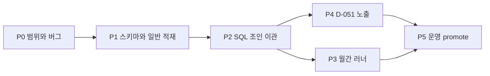

# 축약대장 축 — 구현 계획

> 상태: **P0–P4 로컬 완료** (게이트 1차, apply 안 함) · **P5.1 착수** (2026-08-26)
> 착수 시 이 파일 P0부터. 월간 정책은 [`PARCEL_MASTER_MONTHLY_UPDATE.md`](PARCEL_MASTER_MONTHLY_UPDATE.md). 설계는 [`PARCEL_MASTER_DESIGN.md`](PARCEL_MASTER_DESIGN.md). 결정 D-050 · D-051.
> 운영 promote는 P5.2. `parcel_master` dump 금지.
> P0에서 하는 것: 2019 게이트 · 2018 이전 DELETE · `match_tier` 수정 · 용도지역 동수 tie.
> P0에서 안 하는 것: CASCADE, 「일반」 적재, 전유부, land_stats 흡수, 자동 `is_current`, P4 UI, 운영 promote.

게이트 숫자(로컬 실측, 고정): 계약 2019+ 보강 **498,568행 / 거래 665,030건 = 75.0%**. A1/A2 구성비 동등. 전 기간 604,422를 게이트로 쓰지 않는다.

### 착수 때 읽을 것

1. D-050 — 범위·게이트·DELETE·UPSERT · 아래 **확정 정책**
2. 이 파일 P0 표
3. 월간 SSOT §3.1 (purge × FK) — P3.1에서 고쳤다. CASCADE 넣지 말 것

---

## 확정 정책 (설계 검토 반영)

GPT 검토에 대한 회신으로 고정한 것. 구현이 이 문장을 뒤집지 않는다.

### 명칭과 적재

이 DB의 이름은 **PNU 기반 부동산 속성 DB**다. 「건축물이 있는 토지 DB」가 아니다. 키는 PNU다. 적재는 **수요 필지**(거래·단지·표제부가 가리키는 필지)다. 빈 필지 3,900만을 넣지 않는다. 「건물 있는 595만」 전량 선적재도 목표가 아니다.

### 세 저장소

| | 역할 | 위치 |
|---|---|---|
| **A** | MOLIT 원장 | `built_transactions` / 집합·토지 원장. **덮지 않음** |
| **B** | 필지 속성 | 로컬 `parcel_master` |
| **C** | 매칭 결과 | `built_transaction_enrichment`, 집합 attributes |

`parcel_master`는 VPS dump 금지. 분석은 opt-in LEFT JOIN이지 원장 덮어쓰기가 아니다. 기본통계 마트는 MOLIT-only를 유지한다.

### 주기

독립이다. MOLIT 월 / 표제부 분기 / AL_D* 연. 테이블급 `source_date` · `ledger_snapshot`. CDC(「변동 발생 시」)는 없다.

### 매칭

기본은 **동결** (`ON CONFLICT DO NOTHING`). 미상 재시도는 된다. 확정 행의 값 변경(B→C)은 **새 버전 행 + 명시 승인**이지 `is_current` 자동 전환이 아니다. 버전 SCD는 P0에서 만들지 않는다. P1 DDL에 자리만 둔다.

연속 `match_score`(0.82 같은 발명 점수)는 쓰지 않는다. 복합는 **A1/A2**, 집합은 **A–F / P / T**.

### 화면 (D-051)

opt-in을 확대한다. 사용자에게는 한 행, 출처와 등급을 같이 둔다. 집합은 「경고 없음」이 아니다 — 아파트 조인 성공/실패, 연립·오피·집합상가는 기존 tier, 복합는 항상 A1/A2.

### 지금 범위 밖

전유부(호), `land_stats`를 `parcel_master`에 흡수, 자동 rematch flip, 3,900만 필지, P4 없이 운영 promote.

---

## 의존 순서



P4를 건너뛰고 P5를 하면 헌법 §5를 다시 위반한다. 로컬 SQL 이관(P2)은 화면 없이 진행해도 된다.

---

## P0 — 범위 게이트와 명백한 결함

목적: 이후 적재가 잘못된 전 기간 숫자를 재현하지 않게 한다.

| # | 작업 | 파일 | 완료 조건 |
|---|---|---|---|
| 0.1 | `TX_SQL`에 `contract_year >= :min_year` (기본 2019), CLI `--min-year` | [`pipeline/built/recover_address.py`](../pipeline/built/recover_address.py) | 2018 이전이 매칭 대상에서 빠짐 |
| 0.2 | 2018년 이전 enrichment **105,854행 DELETE** | [`pipeline/built/purge_enrichment_before_year.py`](../pipeline/built/purge_enrichment_before_year.py) | `contract_year < 2019` 건수 0. CASCADE 없음 |
| 0.3 | `match_tier` 반전 버그 수정 + 테스트 | [`backend/app/built/router.py`](../backend/app/built/router.py) | A1이 응답·CSV에 남음 |
| 0.4 | `zone_primary` 동수 tie를 라벨 문자열로 결정론화 | `recover_address.py` `load_zone` · `order_zone_labels` | 재적재해도 대표가 안 바뀜. 캐시 `zone_all_{sido}_v2.json` |

0.2는 사용자 확정. 동결 정책의 예외(범위 축소이지 재매칭이 아님). 이미 있는 2019+ 행은 건드리지 않는다.

---

## P1 — 축약 DB 스키마와 「일반」 적재

| # | 작업 | 완료 조건 |
|---|---|---|
| 1.1 | DDL: `ledger_snapshot`(+`kind`), `parcel_land_price`, `match_revision` 자리 | **완료** 로컬 테이블 |
| 1.2 | 표제부 `ledger_kind='일반'` 3스냅샷. 집합 DELETE 금지 | **완료** 일반 20,235,321 · 집합 1,881,261 |
| 1.3 | 수요 필지 `parcel` overlay (AL_D003) | **완료** overlay 5,694,705 / parcel 6,138,497 |
| 1.4 | AL_D151 → `parcel_land_price` (구코드 29/46→12) | **완료** 5,688,862 · 마트 교집합 99.2% |
| 1.5 | 적재 때마다 `ledger_snapshot` UPSERT | **완료** title 집합·일반 각 46 · al_d003 16 · al_d151 17 |
| 1.6 | 용량·시간 기록 | **완료** 일반 81.7분 · AL_D151 7.8분 · DB 9.3GB |

P2 전에 `python -m parcel_master.load_zone --refresh` 로 일반 필지 용도지역을 채운다. 지금 `parcel_zone` 은 집합 PNU만.

`expand_national.py`는 집합만 넣는다. 「일반」은 [`load_title_general.py`](../pipeline/parcel_master/load_title_general.py) (집합 행 DELETE 금지). 공시지가는 [`load_land_price.py`](../pipeline/parcel_master/load_land_price.py). 수요 필지만.

```
python -m parcel_master.load_title_general
python -m parcel_master.load_land_price
```

---

## P2 — 복합 매칭을 SQL 조인으로

지금 `pipeline/built/`는 `parcel_master`를 0건 참조한다. 목표: `time_fallback` · A1 연면적 ±0.011 · A2 대지면적(표제부→총괄→토지대장) · 대표 용도지역(빈도, 동수 문자열)을 SQL로 재현. 점수는 A1/A2만. 연속 점수를 만들지 않는다.

| # | 작업 | 완료 조건 |
|---|---|---|
| 2.1 | `recover_from_parcel` — 읽기는 `parcel_master`, 쓰기는 enrichment | **충북 스모크** 35,288건 · 신규 28,964 (82.1%) vs 기존 28,956. only_new 16 · only_old 8 · tier_diff 2. 원본 경로 유지. `--apply` 안 함 |
| 2.2 | 동등 게이트 | **완료, apply 안 함.** new 498,753 vs 기존 498,568 · A1 455,413. 분모는 지분 포함 2019+ **665,030** (TX_SQL 매칭 우주는 지분 제외 656,786). 498,753/665,030 = **75.0%**. only_new 434 · only_old 249(표본 전부 A2 `gross_exact_land_tiebreak`) · tier_diff 15. 제주 시도만 기존 대비 +0.4%p. 원본 경로 유지 |
| 2.3 | 실패 시 원본 경로를 끄지 않음 | 유지 |
| 2.4 | 원본 삭제 허용 표시 | 게이트 리포트에만 |

허용오차는 2019 필터·tie 결정론화로 해시가 조금 달라질 수 있음을 전제로, **커버리지와 tier 비**를 1차로 두고 해시 불일치는 샘플 감사한다.

---

## P3 — 월간 러너

SSOT: [`PARCEL_MASTER_MONTHLY_UPDATE.md`](PARCEL_MASTER_MONTHLY_UPDATE.md).

| # | 작업 | 완료 조건 |
|---|---|---|
| 3.1 | `purge_built_contract_window`를 해시 유지 UPSERT로 | **완료.** ingest UPSERT 후 CSV에 없는 해시만 DELETE. `--delete-all`은 창에 enrichment 있으면 거절. FK 제거(`069`, CASCADE 없음). 고아는 허용 |
| 3.2 | `run_built_cycle_csv.py` 마트 **뒤** `--skip-enrich` 기본 on → 구현 후 기본 호출 | **완료.** `--enrich` 없으면 미상 INSERT 안 함. `build_scope_stats`는 원장만 |
| 3.3 | 동결 검증 스크립트 (값 변경 0, 고아 수) | **완료.** `verify_built_enrichment_freeze.py` — 값 변경·확정 행 삭제는 실패. 고아는 리포트(기본 비실패) |
| 3.4 | `--retry-unmatched`는 `ledger_snapshot` 신규 또는 수동 | **실거래 러너 거절.** 대장 달: `python -m built.recover_from_parcel --retry-unmatched` |
| 3.5 | 집합: 신규 키만 조인, A·B·C 덮지 않음. 공부 달 공시지가 재파생 | **완료.** 실거래 러너 skip 기본. `--enrich-new-keys` → `collective.enrich_new_keys`. 대장: `apply_title_fill --refresh-t`. 공부: `import_assessed_land_price --from-parcel-master`. 비주거는 속성 테이블 없음 |

`ON DELETE CASCADE` 도입은 P3 완료 조건이 아니라 **거절 조건**이다. 확정 행 덮어쓰기·`is_current` 자동 전환도 거절.

---

## P4 — 노출 (D-051)

원장 `zone_type`을 덮지 않음. 동의 게이트, 행 배지, 표시=필터, 안내 4문장(2019+ 75.0% · 시점 갭 · 대표 용도지역 49.4% · 인증 서울·충북). P5의 선행. 운영 dump는 이 단계에서 하지 않는다.

| # | 작업 | 완료 조건 |
|---|---|---|
| 4.1 | 동의 4문장 고정 | D-051 JSON · `enrichment_policy.NOTICE` |
| 4.2 | API `enrich=false` 기본. 켜면 LEFT JOIN, 필터=표시 용도지역 | 목록·CSV·회귀·scope 칩 |
| 4.3 | 목록 「건축물대장 확인」배지. 복원 지번 칸 금지 | 프론트 거래표 · CSV `대장확인` · 호버에 매칭 규칙 |
| 4.4 | 집합 목록 조인 배지 (K-apt/표제부/미연결) | `attach_danji_list_fields` |

---

## P5 — 운영

| # | 작업 | 완료 조건 |
|---|---|---|
| 5.1 | `qa_audit` `built_enriched` 어댑터 | D-047 §13 단계 4. 대분류 용도지역 **0건**. CLI `--domain built_enriched`. 운영 dump 아님 |
| 5.2 | `built_stats` dump에 enrichment 포함 promote | 운영 행 수 = 로컬 2019+ |
| 5.3 | `parcel_master`는 dump하지 않음 | VPS에 해당 DB 없음 |

---

## 집합 쪽 (병행 가능)

이미 된 것: 표제부 집합 전국, `builder_master.pnu`, T등급 채움, 공시지가 마트·단지정보·지역회귀 체크박스.

남은 것: D·F 백로그는 축약 DB가 안 푼다. P4 D-051.

---

## 하지 않음

- 전 기간 604,422 동등 재현을 게이트로 쓰는 것
- 복수 용도지역을 회귀 더미로 모두 넣는 것
- 공시지가 거래연도 정합
- 축약 DB VPS 적재
- 원본 선삭제
- P4 없이 운영 보강 적재
- 연속 `match_score` 발명
- 전유부(호) 적재
- `land_stats`를 `parcel_master`에 흡수
- 확정 행의 `is_current` 자동 전환
- 빈 필지 3,900만 선적재
