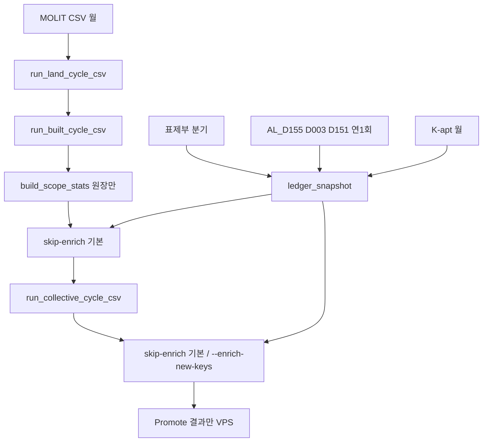

# 축약대장 · 보강 — 월간 운영 SSOT

> 상태: **정책 확정 · P3 러너** (D-050). 실거래 달은 skip-enrich 기본. 운영 promote는 P4 후.
> 설계: [`PARCEL_MASTER_DESIGN.md`](PARCEL_MASTER_DESIGN.md) §7 · 구현: [`PARCEL_MASTER_IMPLEMENTATION.md`](PARCEL_MASTER_IMPLEMENTATION.md)
> 실거래 러너 SSOT는 그대로 [`MONTHLY_UPDATE_CHECKLIST.md`](MONTHLY_UPDATE_CHECKLIST.md)다. 이 문서는 **대장 달력과 enrich**만 더한다.
> 체크리스트·SOP에 적힌 enrich 단계는 지금 실행하지 않는다.

원칙: git/deploy ≠ 월갱신. `parcel_master`는 VPS에 올리지 않는다. 올라가는 것은 도메인 결과 테이블뿐이다. 복합 보강 운영 적재는 D-051 동의 게이트 뒤 P5이며, **지금은 운영 0행이 맞다.**

---

## 1. 한 달에 무엇을 하는지부터 고른다

| 이번 cycle 종류 | 하는 일 | 하지 않는 일 |
|---|---|---|
| **실거래 달** (매월) | MOLIT 12개월 창 재적재, 신규 hash만 enrich(구현 후), 동결 검증, 결과 promote | 표제부·AL_D* 재다운로드, `parcel_master` dump |
| **K-apt 달** (매월, 실거래와 같은 주) | 단지·PNU 파일 갱신 → `builder_master.pnu` | 표제부 재스캔 |
| **대장 달** (분기) | 표제부·총괄 신본 → `building` 스냅샷 INSERT, `ledger_snapshot` 기록, `--retry-unmatched` | 확정 enrichment 재매칭 |
| **공부 달** (연 1회) | AL_D155 · AL_D003 · AL_D151 적재, 공시지가 마트 최신값 재파생 | 전국 3,900만 필지 |

한 cycle이 실거래+K-apt인 달이 기본이다. 대장 달·공부 달은 체크리스트 0.5에 표시한다.



---

## 2. 원본 달력

근거는 D-047 실측(표제부 월 변화 0.1%p 미만, 용도지역 잔차 0.3~0.4%).

| 원본 | 받는 곳 | 우리 주기 | 폴더 규칙 |
|---|---|---|---|
| 실거래 MOLIT CSV | 국토부 포털 · `molit_csv_collector` | **월** | 체크리스트 1.1 |
| K-apt 기본정보 + 필지고유번호 | 공동주택관리정보시스템 | **월** | `raw/` K-apt 관례 파일. 11MB |
| 건축물대장 표제부·총괄 | 건축HUB `mart_djy_03` / `02` | **분기** | 스냅샷 `YYYY-MM` 3본 유지 |
| 토지이용계획 AL_D155 | 브이월드 | **연 1회** | `AL_D155_{시도}_{배포일}/` |
| 토지대장 AL_D003 | 브이월드 | **연 1회** | `AL_D003_{시도}_{배포일}/` |
| 개별공시지가 AL_D151 | 브이월드 | **연 1회** | `AL_D151_{시도}_{배포일}/` · 광주 `29`·전남 `46`은 적재 시 `12`로 맵핑 |

`ledger_snapshot`이 생기기 전에는 분기·연 1회 재시도를 **수동 플래그** `--retry-unmatched`로만 켠다.

---

## 3. 복합 enrich (러너 자리 · 기본 skip)

범위: `contract_year >= 2019`. 2018년 이전 보강 행은 DELETE(범위 축소이지 재매칭이 아님).

현재 러너 [`scripts/monthly/run_built_cycle_csv.py`](../scripts/monthly/run_built_cycle_csv.py): UPSERT → stale purge → `build_scope_stats` → **skip-enrich 기본** → 동결 검증. `--year-from 2021`은 ingest 필터이고 보강 범위(2019)와 다르다.

목표 순서:

1. 최근 12개월 거래는 **해시 유지 UPSERT**. 통째 DELETE 금지.
2. `build_scope_stats` (원장만. 보강 컬럼 없음)
3. enrich: `built_transaction_enrichment`에 없는 hash만, 2019+. 확정 행 `ON CONFLICT DO NOTHING`
4. 검증: 확정 행 중 값이 바뀐 건수 = 0 · 고아 보강 행 수 기록
5. Promote는 D-051 통과 후 `built_transaction_enrichment` 포함

### 3.1 purge × FK

[`db/068_built_transaction_enrichment.sql`](../db/068_built_transaction_enrichment.sql)은 원래 `REFERENCES built_transactions`였다. [`db/069_built_enrichment_orphan.sql`](../db/069_built_enrichment_orphan.sql)이 FK를 제거한다. CASCADE는 없다.

월간 [`run_built_cycle_csv.py`](../scripts/monthly/run_built_cycle_csv.py): **UPSERT ingest → CSV에 없는 해시만 DELETE**. [`purge_built_contract_window.py`](../pipeline/purge_built_contract_window.py) 기본은 `--keep-hashes-file`. `--delete-all`은 창에 enrichment가 있으면 거절. 국토부가 가격·면적을 고쳐 해시가 바뀌면 옛 보강은 고아, 새 해시는 미상으로 다시 매칭한다.

### 3.2 동결

기본은 `ON CONFLICT DO NOTHING`. 미상만 INSERT한다. 확정 행의 값 변경(B→C)은 새 버전 행 + 명시 승인이다. `is_current`를 자동으로 뒤집지 않는다. 버전 SCD는 P0에 없고 P1 DDL에 자리만 둔다.

| 대상 | 매월 | 이유 |
|---|---|---|
| 신규·정정(새 hash) | 한다 | 증분 |
| 이미 확정된 행 | 하지 않는다 | 스냅샷이 바뀌면 벽돌이 철골이 된다 |
| 미상 재시도 | 대장 달에만 | `ledger_snapshot` 신규 행 또는 `--retry-unmatched` |
| 확정 값 변경 | 하지 않는다 | 승인 없는 rematch·자동 `is_current` 금지 |

---

## 4. 집합 enrich

매칭은 결정론이라 키 동결이 필요 없다. 값이 매달 바뀌면 사용자는 흔들림으로 본다.

- 신규 `building_key`만 PNU·표제부 조인 INSERT (`python -m collective.enrich_new_keys`)
- 기존 A·B·C는 덮지 않음 (`ON CONFLICT DO NOTHING`, title fill은 blocked tiers)
- T등급은 대장 달에만 표제부 신본으로 갱신 (`python -m parcel_master.apply_title_fill --refresh-t`)
- 공시지가 마트는 공부 달에 `parcel_land_price` 최신 연도로 재파생 (`python -m collective.import_assessed_land_price --from-parcel-master`). 거래연도 정합 없음
- 비주거 집합은 속성 테이블이 없다. 같은 러너의 skip-enrich가 마트만 돌린다

러너 [`run_collective_cycle_csv.py`](../scripts/monthly/run_collective_cycle_csv.py)는 **skip-enrich 기본**. `--enrich-new-keys`만 실거래 달 신규 키 INSERT. `--refresh-title-t`·`--refresh-land-price`는 거절.

---

## 5. Promote 경계

| 올리지 않음 | 올릴 수 있음 (게이트 후) |
|---|---|
| `parcel_master` 전체 | `built_transaction_enrichment` |
| 표제부·AL_D* 원본 | `collective_building_attributes` · 공시지가 마트 |
| `_cache/` JSON | 도메인 원장·마트 (현행) |

원본 삭제는 SQL 이관 게이트(2019+ 498,568 · 75.0% · A1/A2 동등) 통과 전 금지. 지금 지우면 `recover_address.py`가 멈춘다.

---

## 6. 검증

[`scripts/monthly/verify_built_enrichment_freeze.py`](../scripts/monthly/verify_built_enrichment_freeze.py). 러너가 마트·(skip)enrich 뒤에 호출한다. 값 변경·확정 행 삭제는 실패. 고아·커버리지·상위 용도지역은 리포트(고아는 기본 비실패).

---

## 7. 다운로드 후 적재 명령

실거래 달은 skip-enrich 기본. 주석 줄은 대장·공부·신규 키 opt-in.

```text
# 실거래 달 — skip-enrich 기본
py scripts/monthly/run_built_cycle_csv.py --cycle-id YYYYMM
py scripts/monthly/run_collective_cycle_csv.py --cycle-id YYYYMM

# 집합 신규 키만 (A·B·C 유지)
# py scripts/monthly/run_collective_cycle_csv.py --cycle-id YYYYMM --enrich-new-keys
# python -m collective.enrich_new_keys --dry-run

# 대장 달 미상(복합) · T 갱신(집합)
# python -m built.recover_from_parcel --sido all --min-year 2019 --retry-unmatched
# python -m parcel_master.apply_title_fill --refresh-t

# 공부 달 공시지가
# python -m collective.import_assessed_land_price --from-parcel-master
```
