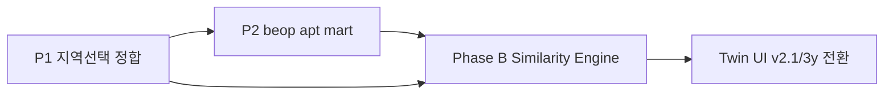

# Regional Profile — Phase B 착수 전 계획 (Preflight)

> **작성:** 2026-07-27  
> **상태:** **P1·P2·Phase B GA 완료** (2026-07-27)  
> **SSOT 상위:** [`REGIONAL_PROFILE_ARCHITECTURE.md`](REGIONAL_PROFILE_ARCHITECTURE.md) §12 · [`DECISIONS.md`](DECISIONS.md) **D-030**

Phase A(Profile v2.1-national · beop Top3 · UI 분리) 완료 후, Phase B(Profile-native Twin)에 앞서 **두 가지 제품·데이터 정합**을 맞춘다.

| # | 항목 | 요약 |
|---|------|------|
| **P1** | 지역 선택 로직 — 토지와 동일 | tier·검색·딥링크를 land `RegionSelector`와 정렬 |
| **P2** | 리 grain 아파트 P25/P50/P75 | beop 집계 + 표본 하한 15건 · eup proxy 금지 유지 |

---

## P1. 지역 선택 — 토지 앱과 동일하게

### 1.1 배경 · 현재 갭

| 축 | 토지 (`frontend`) | 지역 프로필 (`frontend-profile`) |
|----|-------------------|----------------------------------|
| UI | 좌측 `RegionSelector` — tier 칩·검색·Enter | 우측 `RegionSearch` — 텍스트 검색만 |
| 상태 | Zustand `tierSelection` (`TierCodes`) | URL `region_level` + `region_code` |
| loose 주소 | `resolveLooseAddressLine`, `resolveUniqueRegionNameSearch` | **`shared/region-picker` 동일 resolver** |
| city 버킷 | `city_codes` (의사 시, 예: 청주 43110) | **`buildFlattenedRegionSuggestions` city aggregate** |
| 리(beop) 선택 | tier에 `beopjungri_codes` 직접 | API·UI **beop 지원** (Phase A) |
| 토지→프로필 딥링크 | `RegionalProfileLink` → **`resolveProfileRegionFromTier`** | beop → **beopjungri 유지** (P1-a) |
| 복수 선택 | 유료 시군구 미만 최대 10 (D-010) | **단일 지역만** (제품 특성상 유지) |

**문제:** 토지에서 **수태리(리)** 를 고르고 「지역 프로필」로 가면, Profile URL이 **읍·면·동 8자리**로 바뀐다. Phase A 이후 API는 `region_level=beopjungri`를 지원하므로 **사용자가 고른 grain과 Profile 화면 grain이 어긋난다.**

참고 코드:

- 토지 tier → Profile 해석: `frontend/src/utils/upperTierStats.ts` — `resolveProfileRegionFromTier()`
- Profile 딥링크: `frontend/src/components/RegionalProfileLink.tsx`
- Profile 검색: `frontend-profile/src/components/RegionSearch.tsx`

### 1.2 목표 (확정)

1. **동일 grain 유지:** 토지에서 리·읍·면·동·시군구·시·도를 고르면 Profile도 **같은 `region_level` + `region_code`** 로 연다. beop → eup 승격 **폐기**.
2. **검색·해석 규칙 동일:** 지명만 입력, 법정동코드, loose 주소 한 줄, 동명이 리 disambiguation 등 **토지 `RegionSelector`와 같은 resolver** 사용.
3. **Profile은 단일 지역:** 복수 tier 칩·「+ 추가」는 Profile 제품에 **넣지 않음** (D-010 복수 집계와 무관).
4. **URL SSOT:** Profile SPA는 계속 `?region_level=&region_code=` 를 SSOT로 두되, 진입 시 토지 tier와 **1:1 대응**.

### 1.3 구현 계획 (순서)

| 단계 | 작업 | 산출 | 난이도 |
|------|------|------|--------|
| **P1-a** | `resolveProfileRegionFromTier` 개정 — 단일 beop → `{ level: beopjungri, code }` | `upperTierStats.ts` · `RegionalProfileLink` | **낮** |
| **P1-b** | 단일 eup 칩만 있을 때 eup 그대로 (현행 유지) · city/sido/sigungu 동일 | 동일 파일 | 낮 |
| **P1-c** | 공통 모듈 추출 `shared/region-picker/` (또는 `frontend` utils를 workspace alias로 공유) | `TierCodes`, `resolveBeopjungriCodes`, `buildFlattenedRegionSuggestions`, loose resolve | **중** |
| **P1-d** | Profile UI: `RegionSearch` → 토지와 동일 검색·제안 UX (칩은 **현재 선택 1개** 표시) | `frontend-profile` | 중 |
| **P1-e** | 초기 URL ↔ 검색창 라벨 동기화 (토지에서 넘어온 beop 이름 표시) | `App.tsx` + name resolve | 낮 |
| **P1-f** | built/collective 앱 `MacroProfileNavLink` / 딥링크도 동일 규칙 적용 | 각 frontend-* | 낮 |

**의존성:** P1-a는 Phase B와 무관하게 **즉시 가능**. P1-c~f는 공통화 후 일괄.

### 1.4 비목표 (이번 계획에서 하지 않음)

- Profile에서 복수 지역 비교·합산 (D-010 유료 집계와 별개 제품)
- `RegionSelector` 전체를 Profile 좌측 패널에 그대로 복제 (유료/무료 viewMode 분기 불필요)
- 통합 Region SSOT DB / Property Registry (D-014 보류 범위)

### 1.5 검증 체크리스트 (구현 후)

- [x] 토지: 단일 리 선택 → 「지역 프로필」→ URL `region_level=beopjungri` · 코드 10자리
- [x] Profile: 동 URL 새로고침 → 리 grain Top3·yearly_mix·(P2 후) 아파트 분위
- [x] 토지: `가경동` 검색 Enter → eup Profile과 동일 코드
- [x] Profile 단독: loose 주소 한 줄·코드 검색이 토지와 동일 후보 (`shared/region-picker`)
- [x] 복수 beop tier → Profile 링크 **숨김** (현행 `resolveProfileRegionFromTier` null)

---

## P2. 리(beop) grain 아파트 P25 / P50 / P75

### 2.1 배경

- D-029 Phase A: 스키마·Catalog·UI는 **시군구·읍·면·동·리 동일**이나, **리 아파트 분위는 NULL** (v8 **eup proxy 폐기**).
- `yearly_mix`는 beop에서 아파트 **건수·금액** 이미 집계됨 (`_fetch_beop_yearly_from_ledgers`).
- `market_stats` / `build_collective_market_stats.py`는 **eup·sigungu·sido만** — 분위 소스 없음.
- 전국 3년: 아파트 1건+ 리 **3,579** · 15건+ **2,945** (~82%) · 중앙 건수 **124건** → 표본 있는 리가 많음.

**Twin 관점:** `market_mix`(35%)가 아파트 **비중**은 커버. `apartment_profile`(20%)는 **㎡당 가격 티어** 구분용. 리 Twin(동일 시군구 후보)에서 **보조 신호**로 가치 있음. [`TWIN_SIMILARITY_REVIEW.md`](TWIN_SIMILARITY_REVIEW.md) — 가격 sim은 **gate·약한 가중** 권고.

### 2.2 정책 (확정 · D-030)

| 규칙 | 내용 |
|------|------|
| **grain** | **리(beopjungri) 자체** 표본으로 P25/P50/P75 산출 |
| **eup proxy** | **계속 금지** — 읍·면·동 값을 리에 끼워 넣지 않음 |
| **표본 하한** | **`apartment_count >= 15`** (3년 창) 일 때만 분위 저장·표시 · Twin mask=1 |
| **미만·무거래** | 분위 키 **NULL(생략)** · UI 안내 · `market_presence.아파트`는 yearly_mix 기준 |
| **단위** | ㎡당 **만원/㎡** (총액 분위 아님) — §12.2 기존과 동일 |
| **UI 표기** | `formatUnitPrice` → **만원/㎡** (억원/㎡ 변환 사용 금지) |

**변경점:** §12.2 “리→읍 승격 금지”는 **proxy 금지** 의미로 유지. “리 grain 분위 **불가**”가 아니라 “**상위 grain borrowed value 불가**”.

### 2.3 파이프라인 계획

| 단계 | 작업 | 파일 |
|------|------|------|
| **P2-a** | `build_collective_market_stats.py` — `ROLLING_SQL`·`ANNUAL_SQL`에 `beopjungri_code`(10자) GROUP BY 추가 | pipeline |
| **P2-b** | `_rollup_records` — `("beopjungri", beop_code)` bucket 추가 | 동일 |
| **P2-c** | 전국 `market_stats` 재빌드 (window=3 Profile용) | orchestrator |
| **P2-d** | `build_regional_profile.py` — beop row에 `apartment_*` merge (기존 join 경로) | pipeline |
| **P2-e** | 표본 하한: 빌더 또는 `_sanitize_apartment_nulls` 확장 — `count < 15` → price keys pop | pipeline |
| **P2-f** | `regional_profile` v2.1-national 재빌드 | orchestrator |
| **P2-g** | UI `ApartmentProfileCard` — beop에서 분위 있으면 표시; 없으면 「최근 3년 아파트 표본 N건 — 분위 산출 최소 15건」 | frontend-profile |
| **P2-h** | Catalog `mask_from: market_presence.아파트` + **count≥15** 조건 문서·엔진 반영 (Phase B) | catalog / engine |

**예상 공수:** 파이프라인·재빌드 **0.5~1일** · UI **0.5일** · Twin 연동은 Phase B 일정.

### 2.4 Twin Phase B 연동 (참고 — P2 구현 후)

- `apartment_profile` 블록(20%): mask=1인 beop만 기여.
- 가격 유사도: [`TWIN_SIMILARITY_REVIEW.md`](TWIN_SIMILARITY_REVIEW.md) §5 — **순위 흔들기보다 gate·약한 sub-score** 검토.
- `score_detail` 예: `✓ 아파트 ㎡당 가격대(P50) 유사`.
- 리 Twin scope: **동일 시군구** (§12.4) — 전국 tier 오매칭 리스크는 상대적으로 낮음.

### 2.5 검증 체크list (구현 후)

- [ ] beop `4313010600` — apt 760건 → P25/P50/P75 **非NULL**
- [ ] 표본 14건 이하 리 — `apartment_*` 키 없음 · UI 하한 안내
- [ ] eup proxy 없음 — beop 값 ≠ parent eup 값 (spot check)
- [ ] `GET /api/regional-profile?region_level=beopjungri&…` 스모크
- [ ] Phase B: beop Twin 후보에서 `apartment_profile` mask 동작

---

## Phase B Twin과의 순서

| 권장 순서 | 이유 |
|-----------|------|
| **P1-a (딥링크 beop)** | 코드만 · 재빌드 불필요 · UX 즉시 개선 |
| **P2 (beop apt mart)** | Phase B `apartment_profile` 블록을 리에서도 쓰려면 선행 |
| **P1-c~f (검색 공통화)** | Phase B와 병렬 가능 |
| **Phase B Engine** | Catalog·Weight·Candidate·`score_detail` |

---

## 문서·결정 추적

| 문서 | 반영 |
|------|------|
| [`DECISIONS.md`](DECISIONS.md) | **D-030** 추가 |
| [`REGIONAL_PROFILE_ARCHITECTURE.md`](REGIONAL_PROFILE_ARCHITECTURE.md) | §12.2 · §12.5 · §12.7 |
| [`NEXT_STEPS.md`](../NEXT_STEPS.md) | §2b Preflight 표 |
| [`profile_feature_catalog.yaml`](../pipeline/config/profile_feature_catalog.yaml) | `apt_*` mask 주석 (count≥15) — 구현 시 |

*구현 착수 시 본 문서의 체크리스트를 PR·재빌드 로그와 함께 닫는다.*
